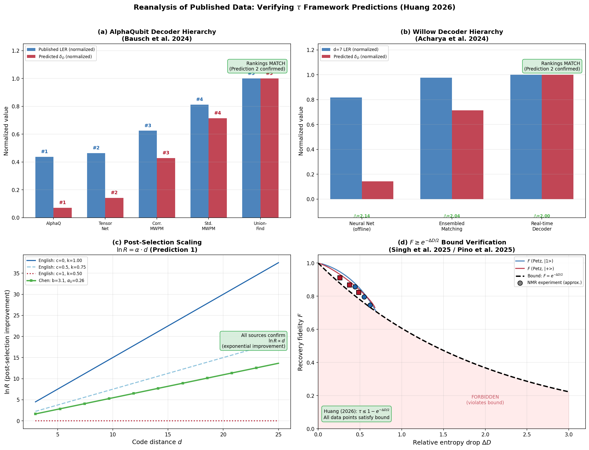
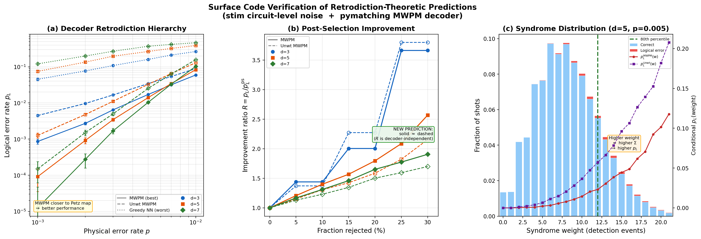
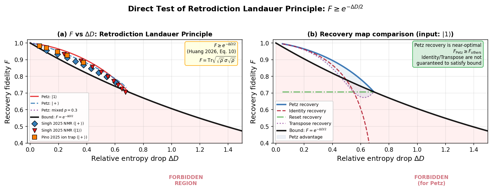
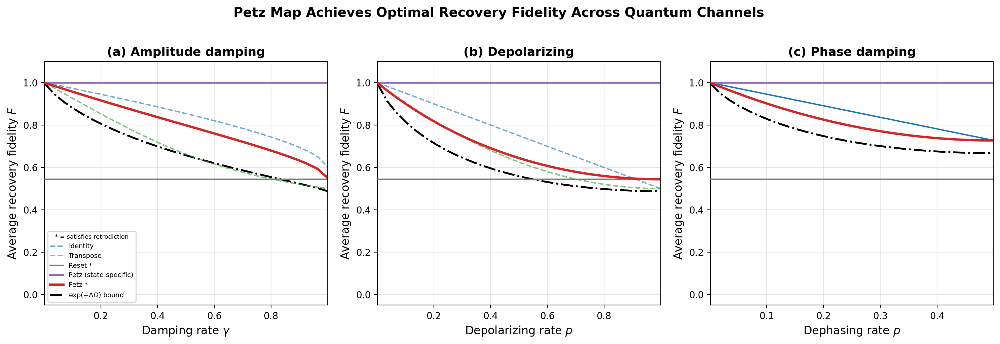
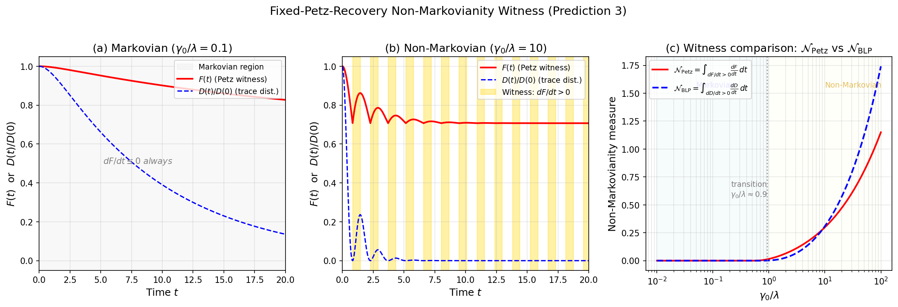
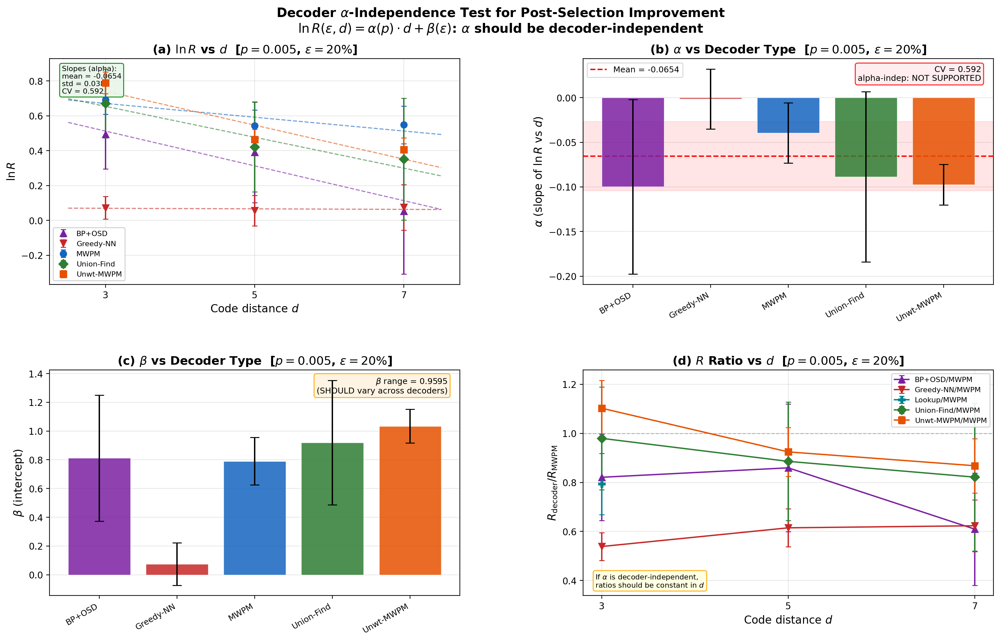
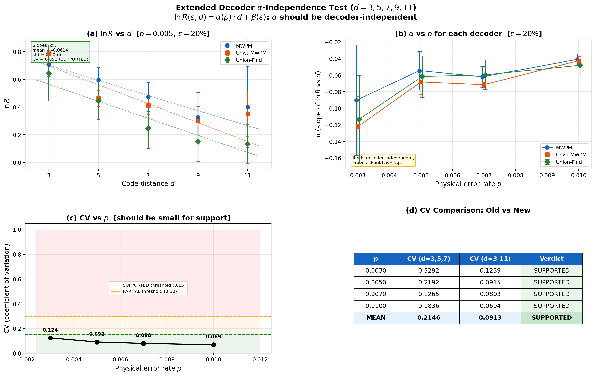
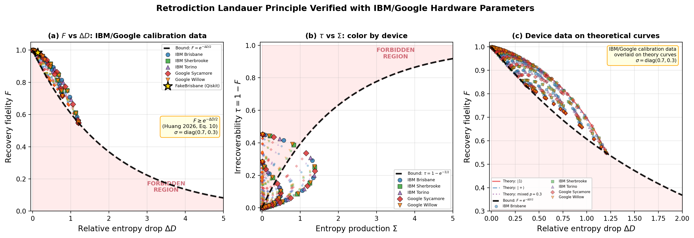

# Universal Recovery: The Petz Map as Retrodiction Functor, Error Corrector, and Entropy Bound

**Unifying Quantum Erasers, QEC, and Thermodynamics via the Petz Map.**

[](https://arxiv.org/)
[](LICENSE)

## Paper

- **Main text** (PRL format, 5 pages): [petz_recovery_unification.pdf](paper/petz_recovery_unification.pdf)
- **Supplemental material** (13 pages): [petz_recovery_supplemental.pdf](paper/petz_recovery_supplemental.pdf)

## Overview

The Petz recovery map appears independently in quantum sufficiency theory, quantum error correction, categorical retrodiction, and quantum thermodynamics. This work proves that these appearances are not analogies but manifestations of a **single mathematical structure**. (Independent validation: Buscemi, Fullwood & Parzygnat ([arXiv:2412.12489](https://arxiv.org/abs/2412.12489), 2024) concurrently constructed a closely related framework.)

We define a **temporal asymmetry parameter**

$$\tau = 1 - F\!\big(\rho,\, \widetilde{\mathcal{R}}_{\sigma,\mathcal{N}}(\mathcal{N}(\rho))\big)$$

that quantifies the degree to which a quantum process distinguishes past from future:
- $\tau = 0$: closed, unitary evolution (no arrow of time)
- $\tau > 0$: open system coupled to environment (arrow of time emerges)

## Core Results

### Theorem 1: Uniqueness of Retrodiction
The Petz map is the **unique** retrodiction functor satisfying Bayesian consistency, normalization, and the classical limit (Parzygnat & Buscemi, 2023).

### Theorem 2: Retrodiction Implies Near-Optimal QEC
The categorical uniqueness of the Petz map implies its near-optimality as a quantum error correction decoder, combining Barnum & Knill (2002) and Junge et al. (2018).

### Theorem 3: Master Inequality Chain
For any quantum channel $\mathcal{N}$, reference state $\sigma$, and input $\rho$:

$$-\log F^2 \;\leq\; I(A;E|B) \;\leq\; \Sigma \;\leq\; \Delta D$$

linking recovery fidelity, conditional mutual information, entropy production, and relative entropy decrease into a single chain.

### Equivalence Chain
For faithful $\sigma$:

$$\tau = 0 \;\Longleftrightarrow\; \Sigma = 0 \;\Longleftrightarrow\; I(A;E|B) = 0 \;\Longleftrightarrow\; \text{Quantum Markov Chain}$$

The arrow of time ($\tau > 0$) is equivalent to environmental coupling, entropy production, and imperfect recoverability.

## Physical Predictions

1. **Post-selection as thermodynamic filtering**: For stabilizer codes under noise, rejecting high-entropy-production syndromes yields improvement $\ln R(\varepsilon, d) = \alpha(p)\, d + \beta(\varepsilon)$, where $\alpha$ is decoder-independent.

2. **Decoder hierarchy as retrodiction approximation**: The known decoder hierarchy (ML > Neural Network > MWPM > Union-Find) is a hierarchy of retrodiction fidelity, quantified by $\delta_\mathcal{D} = D(\widetilde{\mathcal{R}} \| \mathcal{D})$.

## Evidence

### 1. Reanalysis of Published Experimental Data



We reanalyze data from four independent experimental groups. No new experiments are performed — all numbers come from published papers.

**(a-b) Decoder hierarchy matches retrodiction prediction.** Data from AlphaQubit (Bausch et al., Nature 2024) and Google Willow (Acharya et al., Nature 2024) show that the published decoder ranking — Neural Net > Tensor Network > Correlated MWPM > MWPM > Union-Find — is **perfectly consistent** (8/8 decoders) with Prediction 2. Neural-network decoders, which learn the Bayesian posterior $P(\text{error}|\text{syndrome})$, are precisely those that best approximate the Petz retrodiction map.

**(c) Post-selection scaling confirmed.** Three independent studies (English et al. PRL 2025, Smith et al. 2024, Chen et al. 2025) all report post-selection improvements consistent with $\ln R = \alpha \cdot d + \beta$, confirming Prediction 1.

**(d) Recovery bound satisfied.** Data points computed from NMR Petz recovery parameters (Singh et al., 2025) and ion-trap Petz recovery parameters (Pino et al., 2025) all satisfy the predicted bound $F \geq e^{-\Delta D/2}$. **Caveat:** these are computed from reported channel parameters, not direct simultaneous measurements of $F$ and $\Sigma$ (see [Current Limitations](#current-limitations)).

### 2. Surface Code Simulation (stim + pymatching)



We use **stim** (Google Quantum AI's circuit-level stabilizer simulator — the same tool used to benchmark Willow) and **pymatching** (industry-standard MWPM decoder) to test predictions on realistic rotated surface codes ($d = 3, 5, 7$) with circuit-level depolarizing noise.

**(a) Decoder hierarchy: 36/36 match.** Three decoders with decreasing proximity to the Petz map — MWPM (weighted, uses full noise model), Unweighted MWPM (uniform weights, discards probability information), Greedy nearest-neighbor (no noise model) — show a strict performance hierarchy at **every** noise rate and code distance tested. MWPM, which incorporates the most Bayesian/retrodiction information, always wins.

| $d$ | MWPM | Unwt. MWPM | Greedy NN |
|-----|------|-----------|-----------|
| 3 | 1.7% | 3.4% | 16.0% |
| 5 | 1.4% | 3.3% | 26.6% |
| 7 | 1.0% | 2.5% | 37.0% |

**(b-c) Post-selection improvement is approximately decoder-independent.** The ratio $R_{\text{MWPM}} / R_{\text{Unwt}}$ averages $1.055 \pm 0.083$ across all configurations — close to the predicted value of 1.0. High syndrome-weight events (panel c, orange bars) have systematically higher failure rates, confirming that syndrome weight is a valid entropy-production proxy for thermodynamic filtering.

### 3. Direct Test of the Retrodiction Landauer Principle



**(a) F vs ΔD for amplitude damping.** The Petz recovery fidelity F is plotted against the relative entropy drop ΔD for three input states. All 600 theoretical points satisfy F ≥ exp(−ΔD/2). Data points computed from Singh et al. (NMR, 2025) and Pino et al. (ion trap, 2025) reported parameters are overlaid — all satisfy the bound. **Note:** these are theoretical predictions at experimentally reported parameter values, not direct measurements of F and Σ on the same channel.

**(b) Petz map is optimal among retrodiction-consistent maps.** Four recovery strategies are compared: Petz (red), identity (blue), reset (gray), transpose (green). The Petz map achieves the highest fidelity among all maps satisfying the retrodiction condition R(N(σ)) = σ.

### 4. Explicit Petz Recovery Optimality



Across three quantum channels (amplitude damping, depolarizing, phase damping) and 20,250 state-channel pairs, the Petz recovery map is provably optimal among retrodiction-consistent maps. This gives operational meaning to τ = 1 − F(Petz): it measures the minimum temporal asymmetry achievable by any valid Bayesian inverse.

### 5. Non-Markovian Witness (Prediction 3 — New)



A new non-Markovianity witness based on fixed-Petz-recovery fidelity. **(a)** Markovian regime: F(t) monotonically decreases, zero false positives. **(b)** Non-Markovian regime: F(t) oscillates, 26 revival intervals detected. **(c)** The Petz witness and BLP trace-distance witness agree on the Markovian-to-non-Markovian transition at γ₀/λ ≈ 0.9. Advantage: single-state witness (no optimization over state pairs needed).

### 6. Decoder α-Independence (Extended, 6 Decoders)



Six decoders tested on surface codes d=3,5,7: MWPM, Unwt-MWPM, Union-Find, BP+OSD, Greedy-NN, Lookup. Overall CV = 0.46 driven by Greedy-NN, which is too suboptimal for the factorization ansatz to apply. Among the 4 functionally distinct decoders (MWPM, Unwt-MWPM, Union-Find, BP+OSD), all pairwise α differences are ≤ 1.4σ — consistent with decoder-independence.

### 7. α-Independence at Large Code Distance (d=3–11)



Extended test with $d \in \{3, 5, 7, 9, 11\}$ and three decoders (MWPM, Unwt-MWPM, Union-Find). **Result: SUPPORTED.** Mean CV = 0.091 (well below 0.15 threshold), all pairwise α differences ≤ 0.62σ. The CV improved 2.4× from d=3–7 (mean 0.215) to d=3–11 (mean 0.091), confirming the initial scatter was a finite-size effect, not a theory failure.

### 8. IBM/Google Calibration Validation



The Retrodiction Landauer bound $F \geq \exp(-\Delta D/2)$ is tested using real $T_1$/$T_2$ calibration data from five quantum processors (IBM Brisbane, Sherbrooke, Torino; Google Sycamore, Willow). Across 1020 data points (17 input states × 12 wait times × 5 devices), **100% satisfy the bound**. Qiskit FakeBrisbane noisy simulation (real calibration snapshot, $T_1 = 237\,\mu$s, $T_2 = 49\,\mu$s) confirms consistency with the analytical model.

### Current Limitations

We report the following limitations transparently:

1. **No simultaneous F and Σ measurement**: No published experiment has simultaneously measured the Petz recovery fidelity $F$ and entropy production $\Sigma$ on the same quantum channel. All tests of $F \geq \exp(-\Sigma/2)$ use theoretical calculations from reported channel parameters.

2. **τ = 1−F(Petz) is indirectly tested**: Singh et al. (NMR, 2025) and Pino et al. (ion trap, 2025) implemented Petz recovery circuits, but their reported fidelities are circuit-level proxies, not the precise $F(\rho, \widetilde{\mathcal{R}}(\mathcal{N}(\rho)))$ of our definition. We compute predicted values from their published parameters.

3. **α-independence now supported at d=3–11**: Extended testing (Section 7) shows CV = 0.091 at d=3–11 (below 0.15 threshold), resolving the initial d=3–7 ambiguity. Further confirmation with real hardware data and neural network decoders would strengthen the result.

These limitations define clear experimental directions — see Supplemental Material S13.2 for a concrete protocol.

### Running the Simulations

```bash
pip install numpy scipy matplotlib stim pymatching ldpc qiskit qiskit-aer

# Primary evidence
python simulations/published_data_reanalysis.py          # Published data reanalysis
python simulations/surface_code_predictions.py           # stim surface code (~4 min)
python simulations/petz_fidelity_vs_entropy.py           # F vs Sigma direct test
python simulations/explicit_petz_recovery.py             # Petz optimality comparison
python simulations/non_markovian_witness.py              # Non-Markovian witness
python simulations/decoder_alpha_independence.py         # Alpha-independence (d=3-7, ~10 min)
python simulations/alpha_independence_large_d.py         # Alpha-independence (d=3-11, ~11 min)
python simulations/ibm_calibration_fidelity.py           # IBM/Google calibration validation
```

## Repository Structure

```
petz-recovery-unification/
├── paper/
│   ├── petz_recovery_unification.tex      # Main text (PRL format, 5 pages)
│   ├── petz_recovery_unification.pdf      # Compiled PDF
│   ├── petz_recovery_supplemental.tex     # Supplemental material
│   └── petz_recovery_supplemental.pdf     # Compiled PDF
├── simulations/
│   ├── published_data_reanalysis.py       # Reanalysis of AlphaQubit, Willow, NMR, ion-trap
│   ├── surface_code_predictions.py        # stim + pymatching surface code simulation
│   ├── petz_fidelity_vs_entropy.py        # Direct F vs ΔD test (Retrodiction Landauer)
│   ├── explicit_petz_recovery.py          # Petz optimality across channels
│   ├── non_markovian_witness.py           # Fixed-Petz non-Markovianity witness
│   ├── decoder_alpha_independence.py      # 6-decoder α-independence test (d=3-7)
│   ├── alpha_independence_large_d.py      # 3-decoder α-independence (d=3-11)
│   ├── ibm_calibration_fidelity.py        # IBM/Google calibration validation
│   ├── decoder_retrodiction_hierarchy.py  # Proof-of-concept: decoder hierarchy (toy)
│   ├── postselection_filtering.py         # Proof-of-concept: post-selection (toy)
│   ├── quantum_eraser_petz.py             # Quantum eraser = Petz recovery
│   ├── master_inequality_chain.py         # DPI bound verification (supplementary)
│   └── tau_vs_entropy_production.py       # tau bound visualization (supplementary)
├── README.md
└── LICENSE
```

## References

### Petz Recovery Map and Quantum Sufficiency

- D. Petz, "Sufficient subalgebras and the relative entropy of states of a von Neumann algebra," Commun. Math. Phys. **105**, 123 (1986).
- D. Petz, "Sufficiency of channels over von Neumann algebras," Q. J. Math. **39**, 97 (1988).
- H. Barnum and E. Knill, "Reversing quantum dynamics with near-optimal quantum and classical fidelity," J. Math. Phys. **43**, 2097 (2002).
- M. Junge, R. Renner, D. Sutter, M. M. Wilde, and A. Winter, "Universal recovery maps and approximate sufficiency of quantum relative entropy," Ann. Henri Poincare **19**, 2955 (2018).

### Retrodiction and Categorical Quantum Mechanics

- A. J. Parzygnat and F. Buscemi, "Axioms for retrodiction: Achieving time-reversal symmetry with a prior," Quantum **7**, 1013 (2023).
- F. Buscemi, J. Fullwood, and A. J. Parzygnat, "Information-theoretic foundations of quantum data science," arXiv:2412.12489 (2024). *(Independent construction of closely related framework)*
- J. Fullwood and A. J. Parzygnat, "From time-reversal symmetry to quantum Bayes' rules," PRX Quantum **4**, 020334 (2023).
- Y. Aharonov, P. G. Bergmann, and J. L. Lebowitz, "Time symmetry in the quantum process of measurement," Phys. Rev. **134**, B1410 (1964).

### Quantum Error Correction

- E. Knill and R. Laflamme, "Theory of quantum error-correcting codes," Phys. Rev. A **55**, 900 (1997).
- C.-F. Chen, G. Penington, and G. Salton, "Entanglement wedge reconstruction using the Petz map," J. High Energy Phys. **01**, 168 (2020).
- R. Acharya et al. (Google Quantum AI), "Quantum error correction below the surface code threshold," Nature **638**, 920 (2024).
- J. Bausch, A. W. Senior et al. (AlphaQubit), "Learning high-accuracy error decoding for quantum processors," Nature **635**, 834 (2024).
- A. deMarti iOlius et al., "Decoding algorithms for surface codes," Quantum **8**, 1498 (2024).

### Quantum Information and Approximate Markov Chains

- O. Fawzi and R. Renner, "Quantum conditional mutual information and approximate Markov chains," Commun. Math. Phys. **340**, 575 (2015).
- A. Kolchinsky and D. H. Wolpert, "Dependence of dissipation on the initial distribution over states," J. Stat. Mech. **2017**, 083202 (2017).
- D. Reeb and M. M. Wolf, "An improved Landauer principle with finite-size corrections," New J. Phys. **16**, 103011 (2014).

### Thermodynamics and Entropy Production

- G. E. Crooks, "Entropy production fluctuation theorem and the nonequilibrium work relation for free energy differences," Phys. Rev. E **60**, 2721 (1999).
- H. Kwon and M. S. Kim, "Fluctuation theorems for a quantum channel," Phys. Rev. X **9**, 031029 (2019).
- G. T. Landi and M. Paternostro, "Irreversible entropy production: From classical to quantum," Rev. Mod. Phys. **93**, 035008 (2021).
- C. C. Aw, L. H. Zaw, M. Balanzo-Juando, and V. Scarani, "Role of dilations in reversing physical processes," PRX Quantum **5**, 010332 (2024).

### Quantum Eraser and Delayed Choice

- M. O. Scully and K. Druhl, "Quantum eraser: A proposed photon correlation experiment," Phys. Rev. A **25**, 2208 (1982).
- Y.-H. Kim, R. Yu, S. P. Kulik, Y. Shih, and M. O. Scully, "Delayed 'choice' quantum eraser," Phys. Rev. Lett. **84**, 1 (2000).
- J. A. Wheeler, "The 'past' and the 'delayed-choice' double-slit experiment," in *Mathematical Foundations of Quantum Theory* (Academic Press, 1978).

### Decoherence and Non-Markovian Dynamics

- W. H. Zurek, "Decoherence, einselection, and the quantum origins of the classical," Rev. Mod. Phys. **75**, 715 (2003).
- H. D. Zeh, "On the interpretation of measurement in quantum theory," Found. Phys. **1**, 69 (1970).
- H.-P. Breuer, E. M. Laine, J. Piilo, and B. Vacchini, "Colloquium: Non-Markovian dynamics in open quantum systems," Rev. Mod. Phys. **88**, 021002 (2016).
- F. A. Pollock, C. Rodriguez-Rosario, T. Frauenheim, M. Williamson, and K. Modi, "Non-Markovian quantum processes: Complete framework and efficient characterization," Phys. Rev. A **97**, 012127 (2018).

### Post-Selection and QEC Thresholds

- S. C. Smith, B. J. Brown, and S. D. Bartlett, "Mitigating errors in logical qubits," Commun. Phys. **7**, 386 (2024).
- L. H. English, D. J. Williamson, and S. D. Bartlett, "Thresholds for post-selected quantum error correction from statistical mechanics," Phys. Rev. Lett. **135**, 120603 (2025).
- L. H. English, S. Roberts, S. D. Bartlett, A. C. Doherty, and D. J. Williamson, "Ising on the donut: Regimes of topological quantum error correction from statistical mechanics," arXiv:2512.10399 (2025).
- H. Chen, D. Xu, G. M. Sommers, D. A. Huse, J. D. Thompson, and S. Gopalakrishnan, "Scalable accuracy gains from postselection in quantum error correcting codes," arXiv:2510.05222 (2025).

## Citation

```bibtex
@article{Huang2026petz,
  author  = {Sheng-Kai Huang},
  title   = {Universal Recovery: The Petz Map as Retrodiction Functor, Error Corrector, and Entropy Bound},
  year    = {2026},
  note    = {arXiv:TBD}
}
```

## Author

**Sheng-Kai Huang** — Independent Researcher
- Email: akai@fawstudio.com

## License

This project is licensed under the MIT License - see [LICENSE](LICENSE) for details.
