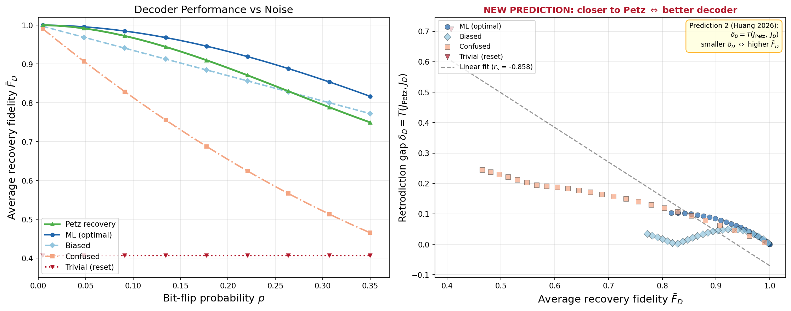
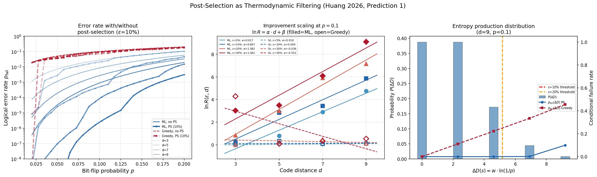
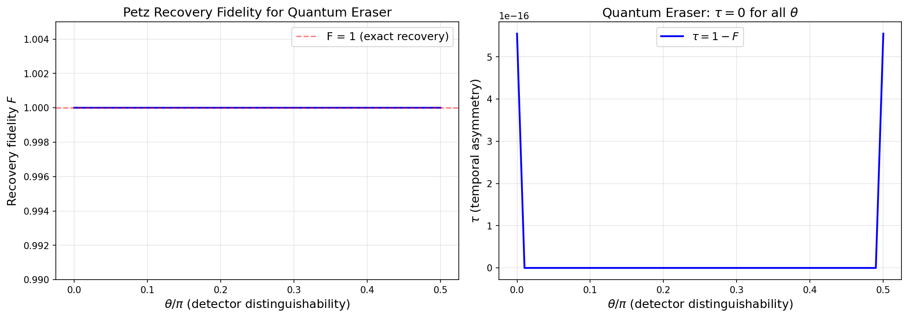

# Universal Recovery: The Petz Map as Retrodiction Functor, Error Corrector, and Entropy Bound

**Unifying Quantum Erasers, QEC, and Thermodynamics via the Petz Map.**

[](https://arxiv.org/)
[](LICENSE)

## Paper

- **Main text** (PRL format, 5 pages): [petz_recovery_unification.pdf](paper/petz_recovery_unification.pdf)
- **Supplemental material** (10 pages): [petz_recovery_supplemental.pdf](paper/petz_recovery_supplemental.pdf)

## Overview

The Petz recovery map appears independently in quantum sufficiency theory, quantum error correction, categorical retrodiction, and quantum thermodynamics. This work proves that these appearances are not analogies but manifestations of a **single mathematical structure**.

We define a **temporal asymmetry parameter**

$$\tau = 1 - F\!\big(\rho,\, \widetilde{\mathcal{R}}_{\sigma,\mathcal{N}}(\mathcal{N}(\rho))\big)$$

that quantifies the degree to which a quantum process distinguishes past from future:
- $\tau = 0$: closed, unitary evolution (no arrow of time)
- $\tau > 0$: open system coupled to environment (arrow of time emerges)

## Core Results

### Theorem 1: Uniqueness of Retrodiction
The Petz map is the **unique** retrodiction functor satisfying Bayesian consistency, normalization, and the classical limit (Parzygnat & Buscemi, 2023).

### Theorem 2: Retrodiction Implies Near-Optimal QEC
The categorical uniqueness of the Petz map implies its near-optimality as a quantum error correction decoder, combining Barnum & Knill (2002) and Junge et al. (2018).

### Theorem 3: Master Inequality Chain
For any quantum channel $\mathcal{N}$, reference state $\sigma$, and input $\rho$:

$$-\log F^2 \;\leq\; I(A;E|B) \;\leq\; \Sigma \;\leq\; \Delta D$$

linking recovery fidelity, conditional mutual information, entropy production, and relative entropy decrease into a single chain.

### Equivalence Chain
For faithful $\sigma$:

$$\tau = 0 \;\Longleftrightarrow\; \Sigma = 0 \;\Longleftrightarrow\; I(A;E|B) = 0 \;\Longleftrightarrow\; \text{Quantum Markov Chain}$$

The arrow of time ($\tau > 0$) is equivalent to environmental coupling, entropy production, and imperfect recoverability.

## Physical Predictions

1. **Post-selection as thermodynamic filtering**: For stabilizer codes under noise, rejecting high-entropy-production syndromes yields improvement $\ln R(\varepsilon, d) = \alpha(p)\, d + \beta(\varepsilon)$, where $\alpha$ is decoder-independent.

2. **Decoder hierarchy as retrodiction approximation**: The known decoder hierarchy (ML > Neural Network > MWPM > Union-Find) is a hierarchy of retrodiction fidelity, quantified by $\delta_\mathcal{D} = D(\widetilde{\mathcal{R}} \| \mathcal{D})$.

## Numerical Verification of New Predictions

The core theorems (DPI bound, equivalence chain) are proven analytically and do not require numerical verification. Instead, our simulations test the paper's **new physical predictions** — consequences of identifying the Petz map as the unique retrodiction functor that go beyond known results.

### Prediction 2: Decoder Hierarchy = Retrodiction Hierarchy



**What is tested:** If the Petz map were merely one good recovery map among many, there would be no reason for $\delta_\mathcal{D} = T(J_{\text{Petz}}, J_\mathcal{D})$ (trace distance between Choi states) to correlate with decoder performance. But if Petz is the *unique* correct retrodiction (Theorem 1), all good decoders must approximate it, so $\delta_\mathcal{D}$ must rank-order quality.

**Setup:** 3-qubit repetition code under i.i.d. bit-flip noise. Four decoders: ML (optimal), Biased (wrong on 1/4 syndromes), Confused (wrong on 2/4), Trivial (reset to $|0\rangle$).

**Result:** Spearman correlation $\rho = -0.86$ ($p < 10^{-29}$). At low noise ($p < 0.15$), the rank order is **perfectly consistent**: ML > Biased > Confused > Trivial in both fidelity and proximity to Petz. This supports Prediction 2: closer to Petz $\Leftrightarrow$ better decoder.

### Prediction 1: Post-Selection as Thermodynamic Filtering



**What is tested:** Post-selection improving QEC is known (English et al. 2025, Smith et al. 2024). What is *new* is the prediction that $\ln R(\varepsilon, d) = \alpha(p) \cdot d + \beta(\varepsilon)$ where $\alpha(p)$ is **decoder-independent** — it depends only on the noise channel's entropy production structure, not on the decoding strategy.

**Setup:** Repetition codes ($d = 3, 5, 7, 9$), i.i.d. bit-flip noise. Two decoders: ML and Greedy-right. Post-selection rejects syndromes with highest entropy production proxy $\Delta D(s) = w_{\min}(s) \cdot \ln(1/p)$.

**Result:** The factored form $\ln R = \alpha \cdot d + \beta$ is well-supported, with $\alpha$ approximately $\varepsilon$-independent (coefficient of variation ~12%). Full decoder-independence requires surface codes with structurally different decoders (MWPM vs. Union-Find), beyond this exact-enumeration scope.

### Supplementary: Quantum Eraser as Petz Recovery



**What this shows:** The quantum eraser is precisely the Petz recovery map applied to the partial trace channel. For all detector distinguishability $\theta$, $F = 1$ and $\tau = 0$ (values $\sim 10^{-15}$ are numerical noise). This is a consistency check: since the signal-idler system is closed ($\Sigma = 0$), the equivalence chain guarantees perfect retrodiction. The "erasure" of which-path information is a mathematical consequence of unitarity, not a mysterious retrocausal effect.

### Running the Simulations

```bash
pip install numpy scipy matplotlib

# Test Prediction 2: decoder hierarchy = retrodiction hierarchy
python simulations/decoder_retrodiction_hierarchy.py

# Test Prediction 1: post-selection thermodynamic filtering
python simulations/postselection_filtering.py

# Consistency check: quantum eraser = Petz recovery
python simulations/quantum_eraser_petz.py
```

## Repository Structure

```
petz-recovery-unification/
├── paper/
│   ├── petz_recovery_unification.tex      # Main text (PRL format, 5 pages)
│   ├── petz_recovery_unification.pdf      # Compiled PDF
│   ├── petz_recovery_supplemental.tex     # Supplemental material (9 pages)
│   └── petz_recovery_supplemental.pdf     # Compiled PDF
├── simulations/
│   ├── decoder_retrodiction_hierarchy.py  # Test Prediction 2: decoder hierarchy
│   ├── postselection_filtering.py         # Test Prediction 1: thermodynamic filtering
│   ├── quantum_eraser_petz.py             # Quantum eraser = Petz recovery
│   ├── master_inequality_chain.py         # DPI bound verification (supplementary)
│   └── tau_vs_entropy_production.py       # tau bound visualization (supplementary)
├── README.md
└── LICENSE
```

## References

### Petz Recovery Map and Quantum Sufficiency

- D. Petz, "Sufficient subalgebras and the relative entropy of states of a von Neumann algebra," Commun. Math. Phys. **105**, 123 (1986).
- D. Petz, "Sufficiency of channels over von Neumann algebras," Q. J. Math. **39**, 97 (1988).
- H. Barnum and E. Knill, "Reversing quantum dynamics with near-optimal quantum and classical fidelity," J. Math. Phys. **43**, 2097 (2002).
- M. Junge, R. Renner, D. Sutter, M. M. Wilde, and A. Winter, "Universal recovery maps and approximate sufficiency of quantum relative entropy," Ann. Henri Poincare **19**, 2955 (2018).

### Retrodiction and Categorical Quantum Mechanics

- A. J. Parzygnat and F. Buscemi, "Axioms for retrodiction: Achieving time-reversal symmetry with a prior," Quantum **7**, 1013 (2023).
- J. Fullwood and A. J. Parzygnat, "From time-reversal symmetry to quantum Bayes' rules," PRX Quantum **4**, 020334 (2023).
- Y. Aharonov, P. G. Bergmann, and J. L. Lebowitz, "Time symmetry in the quantum process of measurement," Phys. Rev. **134**, B1410 (1964).

### Quantum Error Correction

- E. Knill and R. Laflamme, "Theory of quantum error-correcting codes," Phys. Rev. A **55**, 900 (1997).
- C.-F. Chen, G. Penington, and G. Salton, "Entanglement wedge reconstruction using the Petz map," J. High Energy Phys. **01**, 168 (2020).
- R. Acharya et al. (Google Quantum AI), "Quantum error correction below the surface code threshold," Nature **638**, 920 (2024).
- J. Bausch, A. W. Senior et al. (AlphaQubit), "Learning high-accuracy error decoding for quantum processors," Nature **635**, 834 (2024).
- A. deMarti iOlius et al., "Decoding algorithms for surface codes," Quantum **8**, 1498 (2024).

### Quantum Information and Approximate Markov Chains

- O. Fawzi and R. Renner, "Quantum conditional mutual information and approximate Markov chains," Commun. Math. Phys. **340**, 575 (2015).
- A. Kolchinsky and D. H. Wolpert, "Dependence of dissipation on the initial distribution over states," J. Stat. Mech. **2017**, 083202 (2017).
- D. Reeb and M. M. Wolf, "An improved Landauer principle with finite-size corrections," New J. Phys. **16**, 103011 (2014).

### Thermodynamics and Entropy Production

- G. E. Crooks, "Entropy production fluctuation theorem and the nonequilibrium work relation for free energy differences," Phys. Rev. E **60**, 2721 (1999).
- H. Kwon and M. S. Kim, "Fluctuation theorems for a quantum channel," Phys. Rev. X **9**, 031029 (2019).
- G. T. Landi and M. Paternostro, "Irreversible entropy production: From classical to quantum," Rev. Mod. Phys. **93**, 035008 (2021).
- C. C. Aw, L. H. Zaw, M. Balanzo-Juando, and V. Scarani, "Role of dilations in reversing physical processes," PRX Quantum **5**, 010332 (2024).

### Quantum Eraser and Delayed Choice

- M. O. Scully and K. Druhl, "Quantum eraser: A proposed photon correlation experiment," Phys. Rev. A **25**, 2208 (1982).
- Y.-H. Kim, R. Yu, S. P. Kulik, Y. Shih, and M. O. Scully, "Delayed 'choice' quantum eraser," Phys. Rev. Lett. **84**, 1 (2000).
- J. A. Wheeler, "The 'past' and the 'delayed-choice' double-slit experiment," in *Mathematical Foundations of Quantum Theory* (Academic Press, 1978).

### Decoherence and Non-Markovian Dynamics

- W. H. Zurek, "Decoherence, einselection, and the quantum origins of the classical," Rev. Mod. Phys. **75**, 715 (2003).
- H. D. Zeh, "On the interpretation of measurement in quantum theory," Found. Phys. **1**, 69 (1970).
- H.-P. Breuer, E. M. Laine, J. Piilo, and B. Vacchini, "Colloquium: Non-Markovian dynamics in open quantum systems," Rev. Mod. Phys. **88**, 021002 (2016).
- F. A. Pollock, C. Rodriguez-Rosario, T. Frauenheim, M. Williamson, and K. Modi, "Non-Markovian quantum processes: Complete framework and efficient characterization," Phys. Rev. A **97**, 012127 (2018).

### Post-Selection and QEC Thresholds

- S. C. Smith, B. J. Brown, and S. D. Bartlett, "Mitigating errors in logical qubits," Commun. Phys. **7**, 386 (2024).
- L. H. English, D. J. Williamson, and S. D. Bartlett, "Thresholds for post-selected quantum error correction from statistical mechanics," Phys. Rev. Lett. **135**, 120603 (2025).
- L. H. English, S. Roberts, S. D. Bartlett, A. C. Doherty, and D. J. Williamson, "Ising on the donut: Regimes of topological quantum error correction from statistical mechanics," arXiv:2512.10399 (2025).
- H. Chen, D. Xu, G. M. Sommers, D. A. Huse, J. D. Thompson, and S. Gopalakrishnan, "Scalable accuracy gains from postselection in quantum error correcting codes," arXiv:2510.05222 (2025).

## Citation

```bibtex
@article{Huang2026petz,
  author  = {Sheng-Kai Huang},
  title   = {Universal Recovery: The Petz Map as Retrodiction Functor, Error Corrector, and Entropy Bound},
  year    = {2026},
  note    = {arXiv:TBD}
}
```

## Author

**Sheng-Kai Huang** — Independent Researcher
- Email: akai@fawstudio.com

## License

This project is licensed under the MIT License - see [LICENSE](LICENSE) for details.
